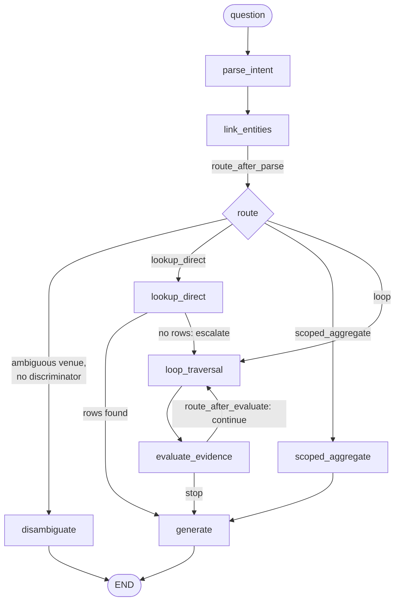

# ARCHITECTURE-SPEC.md
Agentic GraphRAG Hackathon — Three-Pipeline Comparison System

Status: **v0.4 — describes the code on `application-integration` as of 2026-09-27.** Every statement below was checked against the code. | Standard basis: arc42, C4 model, ISO/IEC/IEEE 42010

Related documents: [README.md](../README.md) (running it), [APPLICATION-SPEC.md](APPLICATION-SPEC.md) (FR-/NFR- requirements), [TECHNICAL-SPEC.md](TECHNICAL-SPEC.md) (schema, queries, record contracts, API), [UI-SPEC.md](UI-SPEC.md) (screens), [DEPLOY.md](DEPLOY.md), [EMBEDDING-SWITCHING.md](EMBEDDING-SWITCHING.md) (embedding models and index switching).

---

## 1. Context (C4 Level 1)

| Actor / system | Interaction |
|---|---|
| User / judge | Uses the browser UI: Search (3-column comparison, trace, verdict), Build, Dashboard, History, Settings |
| Batch runner | `ogr.cli batch` or `POST /batch`; runs a question file through all three pipelines and writes scored JSONL |
| TigerGraph (Savanna, or Community Edition 4.2+) | The only graph **and** vector store. Five installed GSQL queries (Q1–Q5); one HNSW index per embedding model; `/restpp/vector/status` is polled before a pipeline is marked ready |
| LLM provider | Intent parsing (function-calling or JSON-schema), the P3 groundedness check, answer generation. Chosen at startup (`LLM_PROVIDER`) or at runtime (presets `gemini`, `nvidia_nim`, `groq`) |
| Embedding host | Cloudflare Workers AI for `bge-large-en-v1.5` (the default, CLS pooling) when credentials are set; otherwise local `sentence-transformers`. Also hosts the P3 reranker `@cf/baai/bge-reranker-base` |
| Corpus and question sets | Olympic Wikipedia corpus (2,951 docs, `data/corpus/*.jsonl`, more datasets can be uploaded); 100 public questions (`data/questions/eval_public.jsonl`); 50 hidden (`acceptance/holdout/eval_hidden.jsonl`, opened only by the batch runner) |

## 2. Containers (C4 Level 2)

```mermaid
flowchart LR
    user([User / judge])
    subgraph browser[Browser]
        ui["React + Vite UI<br/>Search · Build · Dashboard · History · Settings<br/>fetch + EventSource (SSE)"]
    end
    subgraph backend[FastAPI process — backend/src/ogr]
        api["api/main.py<br/>X-API-Key router · SSE stream tokens<br/>query / build / batch / settings / embeddings / history"]
        disp["eval/dispatcher + aggregator<br/>3 pipelines concurrently, verdict"]
        p1["P1 RAG<br/>pipelines/p1_rag.py"]
        p2["P2 GraphRAG<br/>pipelines/p2_graphrag.py"]
        p3["P3 Agentic GraphRAG<br/>LangGraph StateGraph<br/>pipelines/p3_agentic/"]
        ingest["ingest/*<br/>infobox parse · chunk · embed · load<br/>dataset registry · embedding store"]
        batch["eval/batch_runner + store + scorer<br/>(also ogr.cli batch)"]
        gclient["graph/client.py<br/>(pyTigerGraph)"]
        emb["common/embeddings.py<br/>common/rerank.py"]
        llm["common/llm.py<br/>one cached chat model per config"]
    end
    subgraph tg[TigerGraph]
        graph["Graph: Document · OlympicEvent · Games · Sport · Venue · Chunk<br/>Q1–Q5 installed"]
        hnsw["Embedding_* vertex types<br/>one HNSW index per model"]
    end
    llmp["LLM provider<br/>gemini · nvidia_nim · groq · openai_compatible · anthropic"]
    cf["Embedding host<br/>Cloudflare Workers AI → local sentence-transformers"]
    out[("out/<br/>datasets.json · embeddings.json · history.jsonl<br/>run JSONL files")]

    user --> ui
    ui -->|HTTPS JSON + SSE| api
    api --> disp
    api --> ingest
    api --> batch
    batch --> disp
    disp --> p1 & p2 & p3
    p1 & p2 & p3 --> gclient
    p1 & p2 & p3 --> llm
    p1 & p3 --> emb
    ingest --> gclient
    ingest --> emb
    gclient --> graph
    gclient --> hnsw
    llm --> llmp
    emb --> cf
    api --> out
    ingest --> out
    batch --> out
```

| Container | Responsibility | Code |
|---|---|---|
| UI | Search (three independent result columns, live P3 trace, verdict strip), Build (per-pipeline readiness), Dashboard (aggregate benchmark, run picker, per-question eval table), History (every query/build/benchmark trial), Settings (LLM provider/model, embedding model) | `frontend/src/` |
| HTTP API | Routes, API-key auth, SSE streams, in-memory query/build state, dataset registry, embedding store, trial history | `api/main.py`, `api/security.py` |
| Dispatcher + aggregator | Runs P1/P2/P3 concurrently, each in its own failure domain; one aggregator (verdict) for UI and batch | `eval/dispatcher.py`, `eval/aggregator.py` |
| P1 — RAG | Embed the question, Q5 top-k over chunks, no filtering, one generation | `pipelines/p1_rag.py` |
| P2 — GraphRAG | P3's intent parser and entity linker, then exactly one graph query (Q1, Q2/Q3 or Q4), one generation; no evidence check, no fallback, no loop | `pipelines/p2_graphrag.py` |
| P3 — Agentic GraphRAG | LangGraph `StateGraph`: intent → entity linking → necessity routing → direct query or evidence-driven loop → generation (§3) | `pipelines/p3_agentic/` |
| Ingestion | Infobox parser (deterministic), chunking (300/50 tokens), strict embedding with the active model, graph load, query install, vector-readiness wait | `ingest/`, `graph/schema.py`, `graph/vector_status.py` |
| Batch runner | Question file → dispatcher → scored `BatchRecord` JSONL; resume by skipping written `question_id`s; `throughput`/`timing` modes; run-level token ceiling | `eval/batch_runner.py`, `eval/store.py`, `eval/scorer.py` |
| Graph client | All TigerGraph access; Q1–Q5 by name; per-model embedding upsert/delete; cached vocabularies | `graph/client.py` |
| CLI | `build`, `ask`, `batch`, `verify` etc.; used by `make reproduce` | `cli.py`, `verify.py` |

**State files** (`out/`): `datasets.json` (dataset registry: which datasets are loaded, their vertex ids, build metrics), `embeddings.json` (per-model coverage, active model, re-embed job), `history.jsonl` (trial log), and one JSONL file per benchmark run (header line + records).

## 3. P3 orchestrator (C4 Level 3)

The graph built in `build_p3_graph` (`pipelines/p3_agentic/orchestrator.py`). Node names and edges below are the ones in the code.



| Component | Behaviour in the code |
|---|---|
| Intent parser (`intent.py`) | LLM → `{operation, anchor, constraints, target_field}`, Pydantic-validated. One retry that feeds the validation error back. Native tool-calling when the probe (`resolve_tool_calling_support`) says so, otherwise JSON-schema prompting; if the provider rejects tool-calling (HTTP 400) the parser downgrades to the JSON-schema path with the same model (G-6). `qtype` is never read |
| Entity linker (`agents/entity_linking.py`) | Longest-match over closed Games/Sport/Venue vocabularies loaded from the graph (cached per client). Dates via the shared `common/dates.py`. An ambiguous venue with no sport/event discriminator sets `needs_disambiguation` |
| Necessity router (`router.py`) | `route()`: LOOKUP + fully-specified → `lookup_direct`; COUNT/ARGMAX → `scoped_aggregate`; everything else → `loop`. Fully-specified ⇔ (`anchor.title` or `anchor.event_id`) and `target_field` and no constraints |
| Loop tool choice (`router.loop_tool_candidates`) | Each `loop_traversal` pass runs the next applicable tool not yet tried: first `first_loop_tool` (the same choice P2 makes — `lookup` for a named non-TRAVERSE event, `multi_hop` for a named TRAVERSE event, `venue` for a venue anchor, else `traversal`), then `lookup`, `multi_hop`, `venue` (when a venue is known), `traversal`. When none is left the pass does nothing and marks the primary tools exhausted |
| Evidence evaluator (`evidence.py`) | Stage 1 deterministic scope coverage; stage 2 groundedness: deterministic token-overlap pre-check for prose-only evidence, then one LLM YES/NO. When the evidence is unchanged since the last evaluation the previous verdict is reused (no LLM call) |
| Fallbacks (in `node_evaluate_evidence`) | Scope-coverage fail → Q5 similarity search; groundedness fail or empty anchor → `HAS_CHUNK` document retrieval, reranked. A fallback never runs twice with the same inputs (`actions` set: similarity search once per run, document retrieval once per doc-id set) |
| Evidence state | `evidence_reducer` appends but drops items already held, so evidence and citations never repeat and "no new evidence" is detectable |
| Stopping (`stopping.py`, `route_after_evaluate`) | `should_stop` in order: error, disambiguation, sufficient evidence, token budget (default 20,000), step budget (default 6 = `len(path_taken)`), all loop tools and both fallbacks tried. Additionally, when a pass added nothing new, ran nothing new and the primary tools are exhausted, the run stops with `no_further_action_available`. The reason is stored where it is decided; `generate` does not recompute it |
| Direct routes | `lookup_direct` / `scoped_aggregate` are never evaluated and report `stop_reason = direct_route`. An empty direct lookup escalates into the loop (a strategy change) instead of answering from nothing |
| Strategy change (`strategy.py`, `trace.py`) | `strategy_changed` = route-vs-path deviation OR any step flagged by its agent (each fallback flags itself) |
| Trace recorder (`trace.py`) | One emitter for the live SSE stream (`astream_p3_agentic`, built on `astream_events`) and the record's `trace` array. Σ `TraceStep.tokens` is reconciled against the record total |
| Generation (`node_generate`) | Structured rows first, reranked prose after, truncated to 20 items; shared answer contract (same prompt as P1/P2 apart from context). Citations are exactly the items shown to the model, deduplicated |

**Trace `agent_type` values emitted**: `orchestrator` (intent parse / plan), `entity_linking`, `graph_traversal` (Q1, Q4), `multi_hop_reasoning` (Q1→Q4→Q1 chain, Q4 HELD_AT→Q1), `aggregation` (Q2/Q3), `similarity_search` (Q5), `document_retrieval` (`HAS_CHUNK`), `evidence_evaluation`, `answer_generation`.

**Closed `stop_reason` vocabulary**: `sufficient_evidence`, `step_budget_exhausted`, `token_budget_exhausted`, `no_further_action_available`, `disambiguation_required`, `error`, `direct_route`.

## 4. Specialised agents

| Agent | Implementation |
|---|---|
| Entity linking | Dictionary longest-match (`agents/entity_linking.py`) |
| Graph traversal | Q4 PREV_EDITION / HELD_AT (`agents/graph_traversal.py`); Q1 lookup inline in the orchestrator |
| Multi-hop reasoning | Q1 → Q4 → Q1 chain; venue → events via Q4 HELD_AT → Q1 (`agents/multi_hop.py`) |
| Aggregation | Q2 `count_where` / Q3 `argmax`, reporting the `parse_confidence` exclusion count (`agents/aggregation.py`) |
| Similarity search | Q5 over the selected model's HNSW index, strict query embedding (`agents/similarity_search.py`) |
| Document retrieval | `HAS_CHUNK` expansion of the evidence documents, then cross-encoder rerank (`agents/document_retrieval.py`, `common/rerank.py`) |
| Evidence evaluation | Deterministic scope gate + groundedness (§3) |

Several agents are one query. That is the right amount of machinery for five question types.

## 5. Why TigerGraph is load-bearing

Aggregation and superlative questions need exhaustive enumeration over a scoped set, then a numeric operation (up to 43 gold documents per question; median 2, mean 5.5). Top-k retrieval has no notion of "all events in this sport at these Games"; no value of k makes it correct.

| Capability | Why it matters |
|---|---|
| In-database aggregation over a traversed set (Q2/Q3) | What vector search cannot do |
| Venue as a vertex | 303 venues; ~23% of venue+date pairs are not unique ("Olympic Stadium" hosts 115 events); disambiguation needs traversal |
| `PREV_EDITION` edge | A temporal question is one hop, not date arithmetic |
| Vectors next to the graph | Q5 returns chunks via `reverse_HAS_EMBEDDING`; no second store |

## 6. Schema summary (full detail: TECHNICAL-SPEC, EMBEDDING-SWITCHING)

| Vertex | Note |
|---|---|
| Document | `doc_id` = Wikidata QID, equal to `gold_doc_ids` — no id mapping |
| OlympicEvent | Typed INT `competitors`, `nations`, `date_*`; raw `*_text`; `bronze` is `SET<STRING>`; `parse_confidence`. No vector |
| Games, Sport, Venue | Closed vocabularies (21 Games, 41 sports, 303 venues in the Olympic corpus) |
| Chunk | Stored once per chunk, **no vector** |
| `Embedding_Qwen`, `Embedding_EmbeddingGemma`, `Embedding_GteLarge`, `Embedding_Mxbai`, `Embedding_BGELarge` | Primary id = the chunk id; one `emb` vector attribute each (768 for EmbeddingGemma, 1024 otherwise), one HNSW index each, linked by `HAS_EMBEDDING` |

Edges: `DESCRIBES`, `AT_GAMES`, `IN_SPORT`, `HELD_AT`, `PREV_EDITION`, `NEXT_EDITION`, `HAS_CHUNK`, `HAS_EMBEDDING`. Person/NOC vertices and Run/Step trace vertices are not in the schema.

## 7. Embeddings

- Five selectable models in `common/embedding_models.py`, identified by key (never by dimension): `qwen3-embedding-0.6b`, `embeddinggemma-300m`, `gte-large-en-v1.5`, `mxbai-embed-large-v1`, `bge-large-en-v1.5` (default). Each applies its model-card query/document prompts.
- Host order per model: Cloudflare Workers AI (only `bge-large-en-v1.5`, requested with `pooling: "cls"` so it matches the local model) → local `sentence-transformers` → hash fallback. Index writes and query embeddings are **strict**: they raise `EmbeddingUnavailable` rather than use hash noise.
- At most two models are stored (`MAX_STORED_MODELS = 2`). Switching, eviction, resumable re-embed jobs and the query-time `409 embedding_mismatch` block are specified in EMBEDDING-SWITCHING.md.
- The same `config.embedding_model` picks both the query embedding and Q5's `emb_type`, so a query vector only meets its own model's index.

## 8. Runtime views

**Single query** (`POST /query` → `202 {query_id, stream_token}` → `GET /query/{id}/stream?token=`):
1. `_query_config` snapshots config once (one LLM and one embedding model for all three pipelines) and refuses with `409 embedding_mismatch` if the selected model is not complete.
2. The dispatcher runs P1, P2 and P3 concurrently; P3 streams `TraceStep`s as nodes finish.
3. Each pipeline's record is streamed when it is done; the aggregator computes the verdict (token multipliers, accuracy deltas or `"n/a"`) once all three are done.
4. `LLMRateLimitError` (rate limit after `LLM_MAX_RETRIES`) is not folded into an answer: the pipeline card shows the error naming provider and model.

**Build** (`POST /build {dataset, rebuild, reset}` → SSE): schema installed only on first build or reset; parse, chunk, strict embed with the active model, load, install Q1–Q5 (verified with `getInstalledQueries`), wait for `Ready_for_query`. Each pipeline column turns ready only when it can answer. Building another dataset keeps the ones already loaded; building the same one again returns `409 already_built` (rebuild or cancel). No LLM call is made during a build.

**Batch** (`ogr.cli batch` or `POST /batch`): questions not yet in the output file run through the same dispatcher/aggregator; each is scored (EM, F1, precision, recall, completeness) and appended. A question that fails after dispatch is left unwritten and the run ends with `BatchIncompleteError`; rerunning resumes the rest. A rate limit stops the whole run (no new questions start). `timing` mode runs one question at a time for latency figures; `throughput` uses the pool (default 2 concurrent on cloud free tiers).

## 9. Cross-cutting concerns

| Concern | Approach |
|---|---|
| Concurrency | `asyncio.gather` over the three pipelines; sync pipelines run in worker threads; P3 setup off the event loop |
| Fault isolation | Each pipeline, each batch question and each CLI `ask` pipeline is wrapped separately; a failure yields an error record. Exception: `LLMRateLimitError` stops the run by design |
| Observability | Per-step tokens, latency, chunks and citations in the P3 trace; `token_source` per record (`provider`, `local_tokenizer`, `estimated`); embedding backend recorded in each run header and embedding index |
| Reproducibility | Deterministic EM/F1; `run_config` header per run (provider, model, base URL, temperature, seed, embedding model and backend, k, chunking, step/token budgets, run token ceiling, pool size, latency mode, requests per minute); `make reproduce` |
| Security | `X-API-Key` on the router (constant-time compare); single-use, short-lived SSE tokens; unauthenticated: `/health`, `/health/db`, `/health/llm`, `/health/embedding`, `GET /settings` (no secrets in its body); write-time secret check in the run store |
| Anti-overfitting | No question-template regex, no `qtype` read in the answer path, paraphrase set of 15 questions |
| Shared resources | One cached LLM client per config shared by all pipelines (and its rate limiter); one process-wide TigerGraph client; vocabularies cached per client |

## Where the LLM is used

**Allocation rule.** For each step: does an LLM call change result quality, or only add cost for the same outcome? Justified categories: **J1** query rewriting (ambiguous queries only), **J2** re-ranking (cross-encoder first), **J3** response synthesis, **J4** entity/relation extraction for graph construction, **J5** agentic reasoning/planning. Anything else is deterministic or recorded as a judgment call (**JC**).

| Step | Pipelines | LLM or deterministic | Category / reason |
|---|---|---|---|
| Infobox parse → vertices and edges | ingest | Deterministic | J4 not needed: relations are explicit infobox fields |
| Chunking (300 / 50 tokens) | ingest | Deterministic | — |
| Chunk embedding | ingest | Embedding model, no LLM (active model; Cloudflare `bge-large-en-v1.5` or local sentence-transformers) | — |
| Query embedding | P1, P3 fallback | Embedding model, strict, same model as the index | — |
| Q5 vector search, k = 10, unfiltered | P1 | Deterministic | No rewrite, no rerank: P1 is the unfiltered baseline (AD-9, LLM DP-1) |
| Intent parse | P2, P3 | LLM, 1 call (+1 retry on schema failure; +1 on tool-calling rejection) | JC (nearest J1): slot extraction a rule table cannot do under NFR-7; shared so P3−P2 isolates the loop |
| Entity linking, disambiguation | P2, P3 | Deterministic | — |
| Necessity routing, loop tool choice | P2, P3 | Deterministic | — |
| Q1–Q4 graph queries | P2, P3 | Deterministic GSQL | — |
| Scope coverage | P3 | Deterministic | — |
| Groundedness | P3 | Deterministic pre-check, then LLM YES/NO; skipped when evidence is unchanged | J5: decides loop continuation and fallback |
| Rerank of prose chunks | P3 | Cross-encoder `@cf/baai/bge-reranker-base`; input order kept when unavailable | J2 |
| Answer generation | P1, P2, P3 | LLM, 1 call, shared answer contract | J3 |
| Scoring | eval | Deterministic, no LLM | NFR-6, AD-4 |

**LLM calls per query**

| Pipeline | Calls |
|---|---|
| P1 | 1 (generation) |
| P2 | 2 (intent + generation), +1 intent retry on schema failure |
| P3 direct route (`lookup_direct`, `scoped_aggregate`) | 2 (intent + generation) |
| P3 disambiguation | 1 (intent only; no generation) |
| P3 loop | 2 + at most one groundedness call per evaluation with new evidence that the pre-check does not decide; bounded by 6 steps and 20,000 tokens |

No LLM call is made in ingestion, embedding, routing, graph queries or scoring. There is no automatic fallback to another LLM provider.

## Decision log

One line per decision ID cited in the code. `DP-n` numbers were assigned per area and mean different things in different areas; the code qualifies them as `graph DP-n`, `RAG DP-n`, `agent DP-n`, `UI DP-n`, `LLM DP-n`. `FR-n` / `NFR-n` are requirements in APPLICATION-SPEC.md. `Gate: G0…G6` in docstrings refers to the original build gates (G0 vector proven, G1 corpus queryable, G2 P1+P2 answer, G3 scoring + API, G4 P3 answers, G5 full run + UI, G6 submission) and is historical.

### Architecture decisions (AD)

| ID | Decision | Status |
|---|---|---|
| AD-1 | One dispatcher and one aggregator for UI and batch; one trace emitter for stream and record | Followed |
| AD-2 | P3 trace streamed live per step, not assembled afterwards | Followed (`astream_p3_agentic`) |
| AD-3 | P3 stops on evidence sufficiency; budgets are a safety valve, not a fixed step count | Followed |
| AD-4 | Accuracy scored by deterministic EM/F1 against gold, no LLM judge | Followed |
| AD-5 | Necessity routing by parsed operation, not a trained classifier | Followed |
| AD-6 | Local embedding model `BAAI/bge-small-en-v1.5`, 384-dim | **Superseded** by the five-model catalog with per-model `Embedding_*` indices; default `bge-large-en-v1.5` (1024-dim) served by Cloudflare then local (EMBEDDING-SWITCHING.md). What still holds: vectors live in TigerGraph and no LLM is used for embedding |
| AD-7 | Exactly five installed GSQL queries | Followed (Q1–Q5) |
| AD-8 | No Person/NOC vertices or `WON_MEDAL` edges; medallists are event attributes | Followed |
| AD-9 | P1 has no type filter, no rerank, no rewrite, and all documents are embedded | Followed; guarded by `test_p1_unfiltered.py` |
| AD-10 | Shared answer contract `{answer, explanation}`; EM/F1 score `answer` | Followed (`contracts.py`, `invoke_llm_with_answer_contract`) |
| AD-11 | P2 shares P3's intent parser | Followed (same as PLAT-07) |
| AD-12 | Pluggable LLM behind one boundary, pinned within a run | Followed; runtime switching snapshots config per query and per batch run |
| AD-13 | Capability probe for tool-calling and usage, with JSON-schema and tokenizer fallbacks | Followed; extended by G-6 downgrade and the `estimated` token label |
| AD-14 | Two latency modes (`throughput`, `timing`) | Followed |
| AD-15 | Ambiguous venue → disambiguation request, never a guess | Followed in P3 (`disambiguate` node). P2 puts the candidates into the context instead |

### Platform decisions (PLAT)

| ID | Decision | Status |
|---|---|---|
| PLAT-06 | One generation contract used identically by P1/P2/P3 (answer span + explanation) | Followed (= AD-10) |
| PLAT-07 | P2 = P3's intent parser + exactly one query, no evidence check, no fallback, no loop | Followed; `test_p2.py` counts the queries |
| PLAT-08 | Pluggable LLM (`get_chat_model`), capability probe, `token_source` labelling, rate-limit config, batch pool 2 on cloud free tiers | Followed |

### Graph area (graph DP)

| ID | Decision | Status |
|---|---|---|
| graph DP-1 | Dates parsed at ingest into typed INT `date_month`, `date_day_start`, `date_day_end`, `date_year`; same normalizer for questions | Followed (`common/dates.py`) |
| graph DP-2 | Non-integer `competitors`: leading integer, lowered `parse_confidence`, raw text kept; Q2/Q3 exclude rows below 0.9 and return `excluded_count` | Followed |
| graph DP-3 | Q5 takes a `vtype` parameter to choose Chunk or OlympicEvent vectors | **Superseded**: Q5 takes `emb_type` (which model's `Embedding_*` index); only chunks are embedded |
| graph DP-4 | Venue disambiguation request when several events remain | Followed (= AD-15) |
| graph DP-5 | `bronze` is a `SET<STRING>` for third-place ties | Followed |

### RAG area (RAG DP)

| ID | Decision | Status |
|---|---|---|
| RAG DP-1 | 300-token chunks, 50 overlap, k = 10, fixed before the first run, never tuned on results | Followed (`RunConfig` defaults) |
| RAG DP-2 | P1 retrieves over chunks only, all documents, no type filter | Followed |

### Agent loop area (agent DP)

| ID | Decision | Status |
|---|---|---|
| agent DP-1 | Fully-specified anchor rule: (title or event_id) and target_field and no constraints | Followed (`router.is_fully_specified`) |
| agent DP-2 | Fallback triggers: scope fail → Q5; groundedness fail or empty anchor → `HAS_CHUNK`; each fallback flags a strategy change | Followed; a fallback is not repeated with the same inputs |
| agent DP-3 | Budgets (6 steps, 20,000 tokens per query) and closed `stop_reason` vocabulary | Followed; vocabulary extended with `direct_route` |
| agent DP-4 | Deterministic scope gate + one labelled LLM groundedness call (Option A), token-overlap check first (Option B) | Followed |
| agent DP-5 | One accounting module (`invoke_and_count`) for every model call, usage-on-stream enabled, per-step attribution, Σ steps = total | Followed |

### UI / API / eval area (UI DP)

| ID | Decision | Status |
|---|---|---|
| UI DP-1 | Record contract uses data field names (`qid`, `question`, `qtype`), `ground_truth: list[str]`, citations with `source_id` (scored) and `chunk_id` (shown), `chunks_returned` / `citations_count` | Followed |
| UI DP-2 | Precision/recall/F1 over the returned document set for all pipelines; Completeness is an alias of Recall | Followed |
| UI DP-3 | Batch output is append-only JSONL with a `run_config` header | Followed (`eval/store.py`) |
| UI DP-4 | Hidden set in `acceptance/holdout/`, opened only by the batch runner | Followed; CI holdout grep |
| UI DP-5 | `POST` returns `202 {id}`; SSE on `GET …/stream`; native `EventSource` | Followed |
| UI DP-6 | One shared build; three columns show per-pipeline readiness via `BuildEvent.pipeline_affected` | Followed |
| UI DP-7 | Build columns show time and counts; build LLM tokens are 0 and labelled, never faked | Followed in data (`BuildEvent.tokens` is always 0); the Build view shows the embedding model and tier instead of a token row |
| UI DP-8 | SSE authenticated by single-use, short-lived `?token=`; the API key never enters a URL | Followed (`api/security.py`) |

### LLM allocation area (LLM DP and gaps G-n)

| ID | Decision | Status |
|---|---|---|
| LLM DP-1 | Reranker in P3 only; P1 stays unfiltered | Followed |
| LLM DP-2 | Reranker host: Cloudflare `@cf/baai/bge-reranker-base` | Followed; order unchanged when unavailable |
| LLM DP-3 | Rate limit: retry the same provider up to `LLM_MAX_RETRIES`, then raise `LLMRateLimitError` and stop the run; no cross-provider fallback | Followed |
| LLM DP-4 | Embedding failure: same-model chain Cloudflare `bge-m3` → local `bge-m3` → hash | **Superseded** by the per-model host chain in §7 (Cloudflare only for `bge-large-en-v1.5`, then local) with strict mode: index writes and query embeddings raise instead of using hash vectors. `bge-m3` is no longer selectable |
| G-1 | Migrate embeddings to `@cf/baai/bge-m3`, 1024-dim | **Superseded** by the five-model catalog (see AD-6) |
| G-2 | Rerank P3 prose chunks before truncation | Done (`common/rerank.py`, `node_generate`, document retrieval) |
| G-4 | Runtime-selectable LLM provider with live model lists (`gemini`, `nvidia_nim`, `groq`) | Done (`PROVIDER_PRESETS`, `GET /settings/providers`, `GET /settings/models`, `PATCH /settings`) |
| G-5 | Rate-limit error names provider, model and reason | Done (`LLMRateLimitError`) |
| G-6 | A provider rejecting tool-calling downgrades the intent parser to the JSON-schema path, same model | Done (`intent.py`, `test_intent_tool_downgrade.py`) |

## Engineering guards

### Platform rules

| Rule | Where it holds |
|---|---|
| TigerGraph is mandatory for vectors and graph (hackathon eligibility). No FAISS, Chroma, pgvector or other external index | `pyproject.toml` declares none; all vectors are `Embedding_*` attributes in TigerGraph. **Not enforced by CI**: there is no dependency allow-list check |
| P3 orchestration is a LangGraph `StateGraph`; LangChain is the provider boundary | `orchestrator.py`, `common/llm.py` |
| No text-to-GSQL and no LangChain graph QA chains; dispatch is `operation → Q1–Q5` | `test_anti_overfitting.py::test_no_text_to_gsql_chain` |
| Only `common/llm.py` constructs a chat model | Convention; `get_chat_model` cache |

### CI guards (`.github/workflows/ci.yml`)

| Job | Check |
|---|---|
| backend | `pip install -e ".[dev]"`, `ruff check src tests`, `pytest -q` (Python 3.11) |
| frontend | `npm ci`, `npm run lint`, `npm run build`, `npm test` (Node 20) |
| guards: holdout grep | Fails if any file under `backend/src`, `backend/tests` or `frontend/src` other than `backend/src/ogr/eval/batch_runner.py` references `acceptance/holdout` |
| guards: no-test-modified | On pull requests: fails if the PR changes `backend/tests/` and `backend/src/` together unless a commit message contains `TEST-CHANGE: <reason>` |

### Failure modes and their guards

| Failure mode | Guard |
|---|---|
| Two date normalizers get written | Single `common/dates.py`, imported by ingestion and the entity linker |
| P1 "improved" with a reranking or rewriting retriever | `tests/pipelines/test_p1_unfiltered.py` (no candidate set, non-Olympic chunks indexed, no retriever imports) |
| `GraphCypherQAChain` or text-to-GSQL introduced | `tests/pipelines/p3/test_anti_overfitting.py::test_no_text_to_gsql_chain` |
| FAISS/Chroma introduced | Review only (see platform rules) |
| Token usage silently zero | `stream_usage=True`; `tests/pipelines/p3/test_token_reconciliation.py` (Σ steps = total, intent tokens counted) |
| Records drift between modules | One `common/contracts.py`; `frontend/src/types.ts` mirrors it |
| Hidden set read during development | CI holdout grep |
| A test edited to make a build pass | CI no-test-modified check |
| Loop never terminates / repeats itself | `tests/pipelines/p3/test_loop_budget.py`, `test_loop_decisions.py` |

### Decisions locked, and the tests that guard them

| Decision | Test |
|---|---|
| P1 deliberately unfiltered (AD-9) | `backend/tests/pipelines/test_p1_unfiltered.py` |
| P2 = shared intent parser + exactly one query (PLAT-07) | `backend/tests/pipelines/test_p2.py` (`test_lookup_runs_exactly_one_query`, `test_traverse_does_not_loop`, `test_has_no_trace_no_strategy_no_stop_reason`) |
| `qtype` never read in the answer path; no eval-set strings (NFR-7) | `backend/tests/pipelines/p3/test_anti_overfitting.py` |
| No LLM in scoring; scoring deterministic (NFR-6, AD-4) | `backend/tests/eval/test_scorer.py` (`test_repeated_scoring_is_identical`, hand-computed cases); `scorer.py` imports no LLM module |
| Σ `TraceStep.tokens` = record total (agent DP-5) | `backend/tests/pipelines/p3/test_token_reconciliation.py` |
| LOOKUP traverses zero loop edges | `backend/tests/pipelines/p3/test_orchestrator.py::test_lookup_question_routes_zero_loop_edges` |
| Vectors live in TigerGraph, one index per model | `backend/tests/graph/test_schema.py` (schema matches the catalog); no external index dependency |
| Chunk 300 / overlap 50 / k = 10 | `RunConfig` defaults; `backend/tests/common/test_config.py` checks the k default. Chunk size/overlap defaults have no dedicated test |
| Rate limit stops the run, no fallback provider (LLM DP-3) | `backend/tests/pipelines/test_rate_limit_stop.py`, `backend/tests/common/test_llm_providers.py` |
| No secret in a persisted record | `backend/tests/eval/test_store.py` |

## Quality attribute scenarios

| Attribute | Scenario | Response |
|---|---|---|
| Performance | A query during a demo | P1/P2 columns fill in seconds; P3 fills progressively via the trace; bounded by step and token budgets |
| Resilience | An LLM call fails in the P3 loop | That column shows an error; P1/P2 unaffected; a batch question is left unwritten and retried on resume |
| Explainability | "Why did it stop here?" | `stop_reason` on the record, decided at the point of stopping |
| Reproducibility | Rerun after a change | Diff against the prior run's JSONL; run header records config and embedding backend |
| Structural ceiling | Aggregation question through P1 | Wrong at any k; P3 aggregates in the database with full citations |
| Cost honesty | Simple lookup through P1 and P3 | P3 costs more tokens for the same answer; the verdict shows it |

## Risks

| Risk | Mitigation |
|---|---|
| Overfitting to eval phrasings | No template regex, no `qtype` read (tested); paraphrase set |
| Vector index lag → incomplete results | Wait for `Ready_for_query` before a pipeline is ready; embedding `indexing` state |
| GSQL install blocks operations | Five queries, installed once per schema install |
| Venue ambiguity (~23%) | Disambiguation request; adding the Games year does not resolve it (22.9%) because collisions are within one Games |
| Infobox edge cases | `parse_confidence` + coverage report; low-confidence rows excluded from counts and reported |
| Embedding weights unavailable | Strict embedding fails loudly; only `bge-large-en-v1.5` has a remote host |

## Known limitations

- **Round 2 is not implemented.** The hackathon's second round (reasoning over evolving, conflicting or uncertain facts: detecting conflicting versions, supersession, source authority, uncertainty) has no code: there is no fact versioning, conflict detection or source-authority model.
- **`VITE_API_KEY` is not a secret.** The frontend reads it at build time (`frontend/src/config.ts`), so it is compiled into the public JS bundle. The backend must only be reachable from a network you trust, or sit behind real authentication.
- **GSQL is statically tested only.** In this review the schema and Q1–Q5 were checked by static tests (`tests/graph/test_schema.py`, a TigerGraph-semantics fake), not against a live TigerGraph. The first real `install_schema` + `install_queries` is their syntax check.
- **Traversal follows `PREV_EDITION` only.** Multi-hop and traversal agents use PREV_EDITION or HELD_AT; `NEXT_EDITION` exists in the schema and Q4 but no agent calls it (the dataset has no "next edition" questions).
- **Q2 treats a missing value as 0.** The loader writes `competitors` / `nations` as 0 when the infobox has none, so a constraint such as `competitors < 10` counts those events.
- **Datasets sharing doc ids overwrite each other's chunks.** Chunk ids derive from `doc_id`; a second dataset with the same doc ids rewrites the first one's chunks (a rebuild keeps ids another dataset also wrote).
- **Timing-mode latency includes the shared rate limiter.** `latency_ms` is measured around the model call, which waits on the per-client `InMemoryRateLimiter` shared by all pipelines (and on retry backoff).
- **Graph errors are silent.** `TigerGraphClient._run_query` returns `[]` on a connection failure or query error (logged), so a pipeline can finish with `status = done` and an empty or "no evidence" answer.
- **In-memory API state.** Query and build state live in the process; a restart loses in-flight queries (a running re-embed job is marked failed and is resumable).
